# Internal Apps Ideation

This repository demonstrates a **voice-to-implementation workflow** — a process for turning informal voice notes into structured specifications and implementation plans using AI tools.

## Workflow Diagram

```mermaid
flowchart LR
    subgraph Input["👤 Daniel"]
        A[🎙️ Voice Note]
    end

    subgraph Processing["🤖 AI Processing"]
        B[📝 Raw Transcript]
        C[✨ Cleaned Transcript]
        D[📋 Formal Spec]
        E[🏗️ Implementation Plan]
    end

    subgraph Output["📄 Output"]
        F[PDF Report]
    end

    A -->|"Gemini MCP"| B
    B -->|"Gemini 2.5 Flash"| C
    C -->|"Claude Opus 4.5"| D
    D -->|"Claude Opus 4.5"| E
    E -->|"WeasyPrint"| F

    style A fill:#f0fdf4,stroke:#16a34a
    style B fill:#fffbeb,stroke:#f59e0b
    style C fill:#fffbeb,stroke:#f59e0b
    style D fill:#faf5ff,stroke:#7c3aed
    style E fill:#faf5ff,stroke:#7c3aed
    style F fill:#f0f9ff,stroke:#0284c7
```



## Workflow Stages

Each stage of the workflow is preserved in this repository:

| Stage | Source | Tool | File |
|-------|--------|------|------|
| 1. Voice Note | Daniel | — | [notes.mp3](input/notes.mp3) |
| 2. Raw Transcript | Daniel | Gemini Transcription MCP | [voice-note-on-custom-ai-workflow-deployment.md](input/voice-note-on-custom-ai-workflow-deployment.md) |
| 3. Cleaned Transcript | Daniel | Gemini 2.5 Flash | [workflow-ideas-for-ai-powered-productivity.md](input/workflow-ideas-for-ai-powered-productivity.md) |
| 4. Formal Specification | Claude Opus 4.5 | Claude Code | [SPEC.md](input/SPEC.md) |
| 5. Implementation Plan | Claude Opus 4.5 | Claude Code | [output3a-implementation-approach.md](output/turns/output3a-implementation-approach.md) |

## Final Output

The complete workflow — from raw voice note to implementation plan — is compiled into a single document:

**[📄 View the PDF: Internal Tools Workspace — From Voice Note to Implementation Plan](output/internal-tools-ideation-flow.pdf)**

---

## The Project Idea

The voice note explores building a unified "AI workspace" — a shell/wrapper that bundles together small AI-powered utilities (whiteboard cleanup, end-of-day logging, etc.) with shared authentication and environment variables.

## Tools Used

| Tool | Purpose |
|------|---------|
| Gemini Transcription MCP | Voice-to-text transcription |
| Gemini 2.5 Flash | Transcript cleanup and formatting |
| Claude Code (Opus 4.5) | Specification extraction and implementation planning |
| WeasyPrint | PDF generation from HTML |

## Repository Structure

```
├── input/
│   ├── notes.mp3                                       # Original voice recording
│   ├── voice-note-on-custom-ai-workflow-deployment.md  # Raw transcript
│   ├── workflow-ideas-for-ai-powered-productivity.md   # Cleaned transcript
│   └── SPEC.md                                         # Formal specification
├── output/
│   ├── internal-tools-ideation-flow.pdf                # Final compiled document
│   ├── internal-tools-ideation-flow.html               # Source HTML
│   └── turns/                                          # Intermediate AI outputs
└── CLAUDE.md                                           # Project context
```
