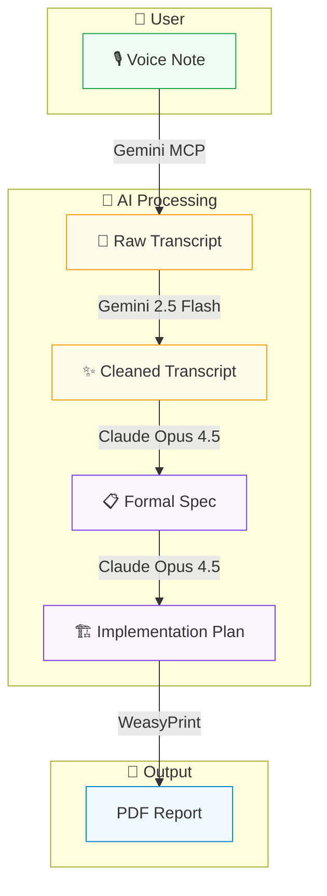

# Internal Apps Ideation

This repository demonstrates a **voice-to-implementation workflow** — a process for turning informal voice notes into structured specifications and implementation plans using AI tools.

## Workflow Diagram



## Workflow Stages

Each stage of the workflow is preserved in this repository:

| Stage | Source | Tool | File |
|-------|--------|------|------|
| 1. Voice Note | User | — | [View](input/notes.mp3) |
| 2. Raw Transcript | User | AI (Gemini Transcription MCP) | [View](input/voice-note-on-custom-ai-workflow-deployment.md) |
| 3. Cleaned Transcript | User | AI (Gemini 2.5 Flash) | [View](input/workflow-ideas-for-ai-powered-productivity.md) |
| 4. Formal Specification | AI (Claude Opus 4.5) | AI (Claude Code) | [View](input/SPEC.md) |
| 5. Implementation Plan | AI (Claude Opus 4.5) | AI (Claude Code) | [View](output/turns/output3a-implementation-approach.md) |

## Final Output

The complete workflow — from raw voice note to implementation plan — is compiled into a single document:

**[📄 View PDF](output/internal-tools-ideation-flow.pdf)**

---

## The Project Idea

The voice note explores building a unified "AI workspace" — a shell/wrapper that bundles together small AI-powered utilities (whiteboard cleanup, end-of-day logging, etc.) with shared authentication and environment variables.

## Tools Used

| Tool | Purpose |
|------|---------|
| Gemini Transcription MCP | Voice-to-text transcription |
| Gemini 2.5 Flash | Transcript cleanup and formatting |
| Claude Code (Opus 4.5) | Specification extraction and implementation planning |
| WeasyPrint | PDF generation from HTML |

## Repository Structure

```
├── input/
│   ├── notes.mp3                                       # Original voice recording
│   ├── voice-note-on-custom-ai-workflow-deployment.md  # Raw transcript
│   ├── workflow-ideas-for-ai-powered-productivity.md   # Cleaned transcript
│   └── SPEC.md                                         # Formal specification
├── output/
│   ├── internal-tools-ideation-flow.pdf                # Final compiled document
│   ├── internal-tools-ideation-flow.html               # Source HTML
│   └── turns/                                          # Intermediate AI outputs
└── CLAUDE.md                                           # Project context
```
